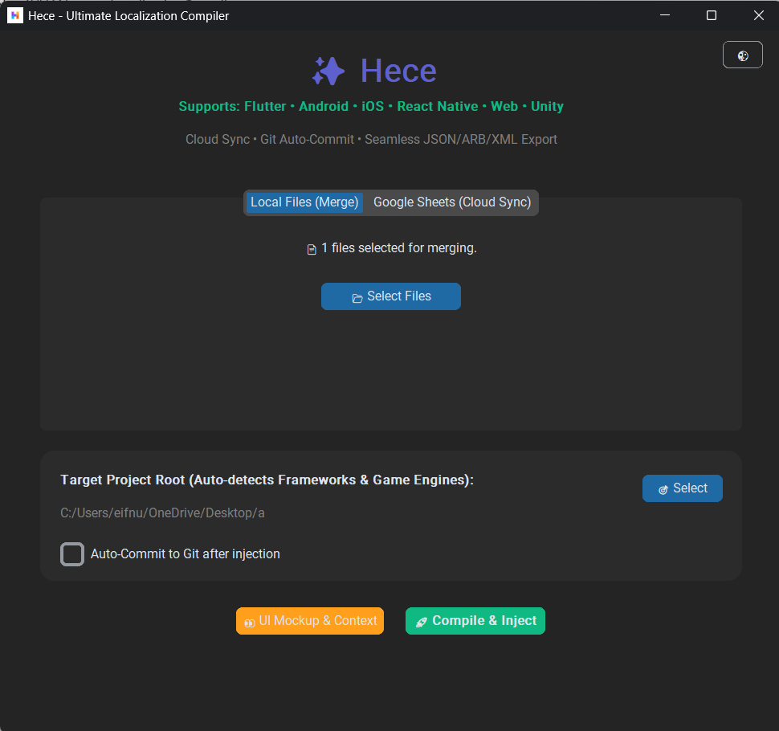
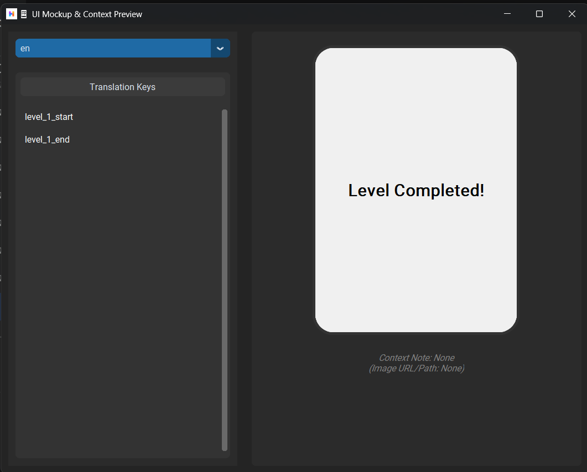
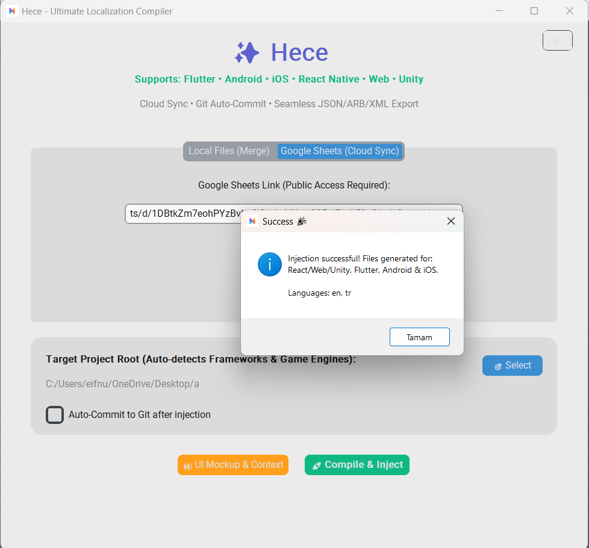
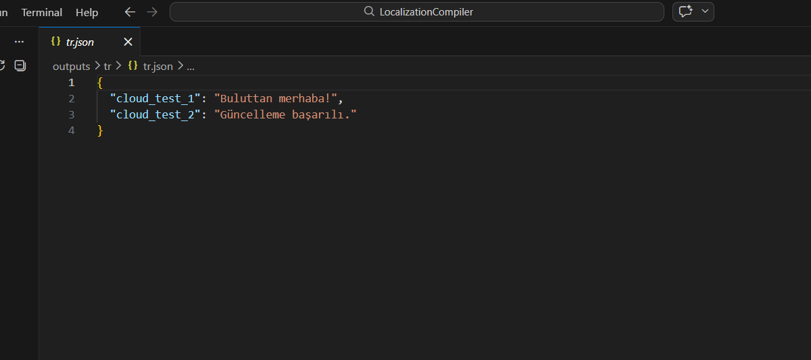

# 🌍 Hece: The Ultimate Localization Compiler 🚀

**Stop wasting hours on manual localization!** Hece is a professional desktop tool built to automate your localization workflow across all major frameworks.

[**Get Lifetime Access on itch.io ($39)**](https://codebygunes.itch.io/hece-ultimate-localization-compiler)

---

## 🔥 The Problem
Managing multiple `JSON`, `ARB`, and `XML` files while syncing with Google Sheets is a nightmare. It's slow, error-prone, and kills productivity.

## ✅ The Solution: Hece
Hece bridges the gap between your spreadsheets and your code. **One click. Zero errors.**

### ✨ Key Features
* **📦 Universal Support:** Generate native files for **Flutter (.arb)**, **Unity (.json)**, **React Native (.json)**, **Android (.xml)**, and **iOS (.strings)**.
* **☁️ Live Cloud Sync:** Connect your public Google Sheets and fetch live data instantly.
* **⚙️ One-Click Injection:** Automatically detects your project root and injects the files into the correct directories.
* **🧩 Visual Preview:** Includes a built-in UI Mockup tool to see your translations in context before you even run your app.
* **🛡️ Git Integration:** Optionally auto-commit your changes after generation.

---

## 📸 See it in Action

  
  

  
  

---

## 💰 No Subscriptions. No Bullsh*t.
Unlike cloud-based localization platforms that charge you monthly fees, Hece is a **one-time purchase**. 

* **Lifetime updates.**
* **Unlimited projects.**
* **Privacy first** (Everything runs locally on your machine).

### [🚀 DOWNLOAD HECE NOW ($39)](https://codebygunes.itch.io/hece-ultimate-localization-compiler)

---
*Built with ❤️ by **Code by Güneş** for the global developer community.*
